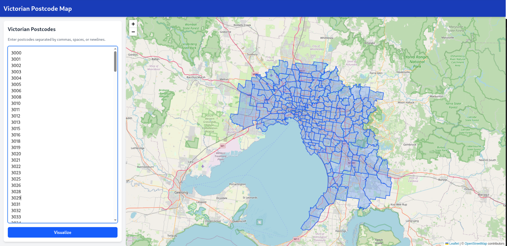

# Victorian Postcode Map

A React application that visualizes Victorian postcode boundaries on an interactive map. Users can input a list of postcodes, and the application fetches the corresponding boundary data from the Vicmap Admin ArcGIS API and displays them as polygons.



## Features

-   **Postcode Input**: Accepts a comma-separated list of Victorian postcodes.
-   **Interactive Map**: Visualizes postcode boundaries using Leaflet.
-   **Data Fetching**: Retrieves real-time boundary data from the Vicmap Admin ArcGIS API.
-   **Batching**: Handles large lists of postcodes by batching API requests.
-   **Responsive Design**: Built with Tailwind CSS for a modern, responsive UI.

## Technologies Used

-   **Frontend Framework**: [React](https://react.dev/) + [TypeScript](https://www.typescriptlang.org/)
-   **Build Tool**: [Vite](https://vitejs.dev/)
-   **Styling**: [Tailwind CSS v4](https://tailwindcss.com/)
-   **Mapping**: [Leaflet](https://leafletjs.com/) & [React Leaflet](https://react-leaflet.js.org/)
-   **Data Source**: [Vicmap Admin ArcGIS API](https://services.land.vic.gov.au/catalogue/publicproxy/guest/dv_geoserver/wfs)

## Getting Started

1.  Clone the repository:
    ```bash
    git clone https://github.com/tomsshanley/Vic-Postcode-Map.git
    ```
2.  Install dependencies:
    ```bash
    npm install
    ```
3.  Start the development server:
    ```bash
    npm run dev
    ```
4.  Open your browser and navigate to `http://localhost:5173`.

## Usage

1.  Enter a list of Victorian postcodes (e.g., `3000, 3121, 3056`) in the text area.
2.  Click the "Visualize" button.
3.  The map will update to show the boundaries of the entered postcodes.
